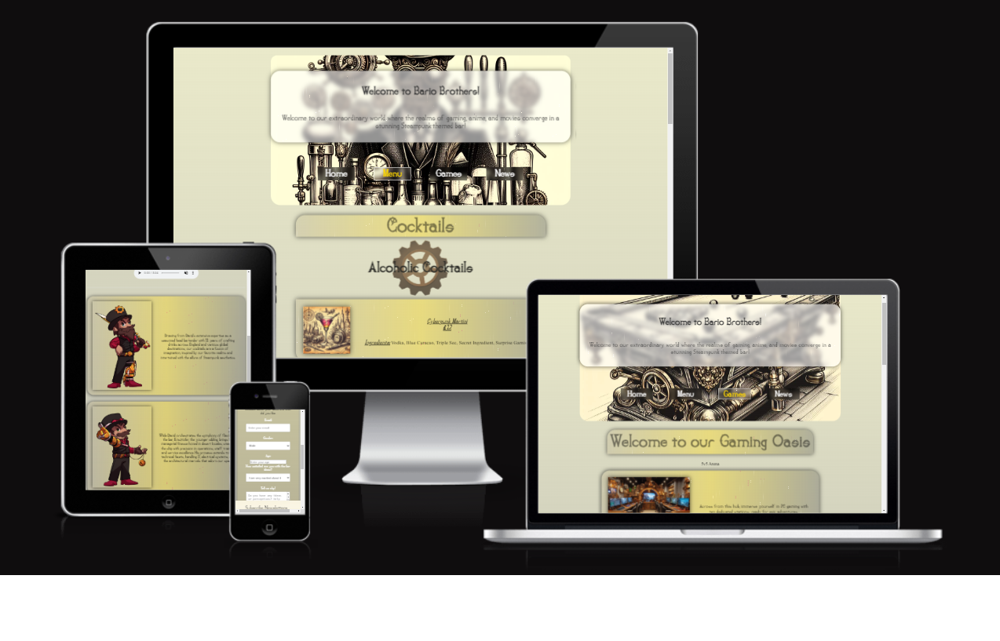

# Super Bario Brothers Kickstarter

## Overview
This project is a responsive website featuring various sections such as a header, navigation menu, footer, news section, gaming section, and an audio player. The design includes modern styling with glassy effects and a consistent theme throughout the pages. The website is optimized for various screen sizes and has been tested on different devices and resolutions.

## Features
- Header with a glassy effect on the heading
- Navigation menu with internal links
- Footer section with social media links and copyright information
- News section with form structure and styling
- Gaming section with menu items and card-style layout
- Audio player for listening to audio content

## Bugs and Fixes
- Bug fixed: Social media links in the footer were not functioning properly
- Bug fixed: Button text alignment adjusted for better responsiveness
- Bug fixed: Body main class missing in CSS
- Bug fixed: Overwrite CSS rule applied to change background on current page

## Potential Improvements
- Further optimization for smaller screen sizes to ensure optimal use on devices with widths below 366px
- Refactoring of CSS code for better maintainability and readability
- Adding additional features such as dynamic content loading and interactive elements

## Screenshots

## Purpose of the Page
Help shape our vision by sharing your thoughts and ideas. Your input will craft the final concept we'll bring to Kickstarter. Sign up, share your opinions, and be the first to know when we launch our campaign!

## Acknowledgments
- YouTube
- My previous projects
- ChatGPT

## Testing
This project has been thoroughly tested on Chrome inspect tool with various devices and resolutions including iPhone 14 Pro Max, iPad Mini, standard HD, and Full HD. The minimum required width for optimal use is 366px. Both W3School and Jigsaw validators have shown perfect results with no issues at all.

## Deployment
The project was deployed through GitHub Live Pages.
